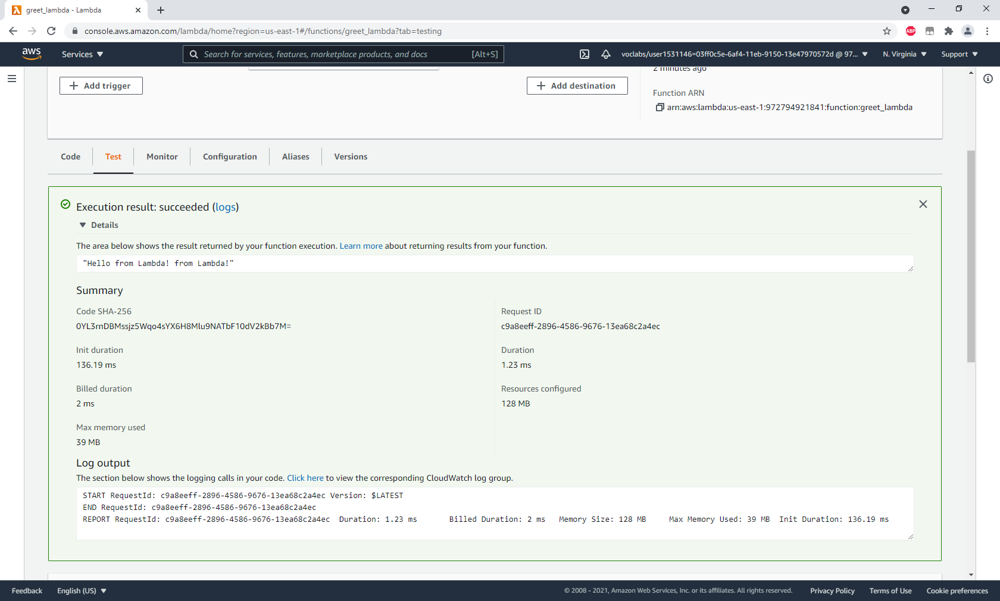

# Cloud Developer ND Course 2: Design for Performance and Scalability

---

## Cost Estimate

### Original Cost

For target monthly estimate around $8000-10000 I used db.r5.2xlarge for the 2 database instance and calculated with an average of 4 m5.xlarge instance in each auto-scaling group of web and application services. I've also added some realistic data storage and transfer. The total monthly estimate is $8690.

### Reduced Cost

By using reserved database instances instead "on demand", the price dropped from $3037 to $2350. The price has 10 TB of storage in it, which is not affected by the reservation.

The price can be lowered a bit more by paying up-front, to $2163, I didn't include it in the calculation, since it might not be possible due to monthly budget.

The auto-scaling groups can also make use of Reserved and Spot instances as described here: https://docs.aws.amazon.com/autoscaling/ec2/userguide/asg-purchase-options.html

Spot instances would give the best reduction in price, but they can be terminated in 2 minutes notice, which might not be tolerable here.

The original estimate was $2290, with reserved instances that reduces to $1461. 

These savings reduce the monthly cost to around $6700 without affecting performance, but it's still over the $6500 budget, so I reduced the database instances to db.r5.xlarge for $1795, to save another $500. Final estimate is $6058.

In reality, the usage of the EC2 instances would have to be measured, and the reserved instances should be configured to best match the usage, mixing with on-demand instances to overcome changes in demand. Also, with such heavy usage, a custom deal with Amazon can bring down the price up to 30%.

### Increased Budget

Having more than double budget allows both additional redundancy and performance. I've set up a backup site in N. Virginia with  a single database and 4 running  EC2 instances for immediate takeover if the Ohio fails. The database is normally a read replica, but can be activated if necessary.

Both the database and the EC2 instances in the primary region are upgraded (db.r5.8xlarge and m5.4xlarge) for better performance. Still using reserved instances, the total monthly price is $19000.

### Task 5 : Use Terraform to Provision AWS Infrastructure

### Exercise 1

Resources used:

How to use the credentials file: https://medium.com/xebia-engineering/best-practices-to-create-organize-terraform-code-for-aws-2f4162525a1a

How to create multiple instances: https://automateinfra.com/2021/03/22/how-to-launch-multiple-ec2-instances-on-aws-using-terraform/

After running the apply command, I changed the "count" to 0 of the M4 instances to delete them without removing the code from the main.tf file.

### Exercise 2

Resources used (copy-pasted and modified the examples):

https://registry.terraform.io/providers/hashicorp/aws/latest/docs/resources/lambda_function

The EC2 and VPC were not affected by this modification, but nevertheless I included the requested screenshots.

The CloudWatch log (screenshot in terraform_2_3.png) doesn't show much, here's the screenshot of the test:

